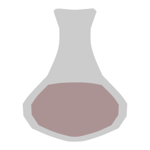

#### Elixir bundle for Howl

**Includes**:
- API **completion** and **docs** with respect for imports and aliases
- static source checks via **dogma** or **credo**
- syntax highlighting
- structure view

**Configuration variables:**
- elixir_linter : either `dogma`, `credo` or `none`
- elixir_path : a string, example: `/home/rokf/.asdf/bin:/home/rokf/.asdf/shims`

The path is prepended to the `PATH` env variable used by Howl so that `mix` and other
needed executables for Elixir can be found.

**Installation:**
- `git clone` into `~/.howl/bundles`

**Dependencies:**
- `lpeg` (@**luarocks**)
- `serpent` (@**luarocks**)
- `lfs` (@**luarocks**)
- `elixir` and `mix` ofc

**API generation:**
To generate your own `api.lua` file you have to
- write a gsources.lua file next to `generate.lua`
- it has to return a table with strings, those are paths the script should use to generate the API
- call `lua generate.lua` and the new `api.lua` file will be generated

**Notes:**
- The **project path** in Howl has to point to the root of your **mix** project.
